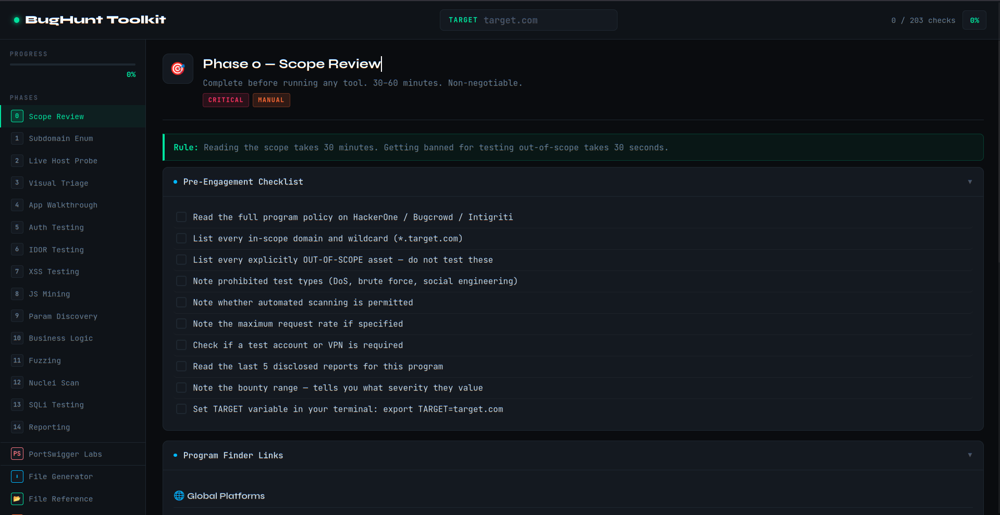

<h1 align="center">
  <a href="https://other4.github.io/raje-bug-toolkit/">
    
  </a>
  <br>
  <p>BugHunt Toolkit — Browser-Based Bug Bounty Workflow</p>
</h1>
<p align="center">
  <a href="#"></a>
  <a href="#"></a>
  <a href="#"></a>
  <a href="#"></a>
  <a href="#"></a>
  <a href="#"></a>
  <a href="#"></a>
</p>
<p align="center">
  <a href="#-features">Features</a> •
  <a href="#️-phases-covered">Phases</a> •
  <a href="#-generated-scripts">Scripts</a> •
  <a href="#-portswigger-labs-coverage">PortSwigger Labs</a> •
  <a href="#-usage">Usage</a> •
  <a href="#️-tools-referenced">Tools</a> •
  <a href="#-expected-output-file-structure">Output Files</a> •
  <a href="#️-legal--ethical-use">Legal</a> •
  <a href="#-contributing">Contributing</a> •
  <a href="#-license">License</a>
</p>

## 📸 Preview

> A dark-themed, single-file HTML toolkit that runs entirely in your browser — no install, no backend, no dependencies.



---


---

## ✨ Features

- **15 hunting phases** — from passive recon to vulnerability reporting, in the correct order
- **Persistent progress tracker** — checkboxes per phase with a live overall progress bar
- **Target-aware copy** — set your target domain once; every command and script auto-fills it
- **One-click script generator** — downloads 11 pre-filled bash scripts ready to run (`chmod +x`)
- **269 PortSwigger lab solutions** — every technique across 31 vulnerability classes, searchable
- **Program finder** — curated links to global, EU, and India-based bug bounty platforms
- **File output reference** — maps every generated file to its purpose and priority
- **Timeline & anti-patterns** — realistic expectations and the mistakes that produce zero findings
- **interactsh integration** — free Burp Collaborator alternative built into every OOB payload
- **Zero dependencies** — pure HTML/CSS/JS, no frameworks, no CDN calls for logic


## 🗂️ Phases Covered

| # | Phase | Type |
|---|-------|------|
| 0 | Scope Review | Manual · Critical |
| 1 | Passive Subdomain Enumeration | Automated |
| 2 | Live Host Probing & Tech Fingerprinting | Automated |
| 3 | Visual Triage (Screenshots) | Automated + Manual |
| 4 | Manual Application Walkthrough | Manual · Critical |
| 5 | Authentication Flow Testing | Manual |
| 6 | IDOR Testing | Manual |
| 7 | XSS Testing | Manual → Automated |
| 8 | JS Mining & Secret Discovery | Automated + Manual |
| 9 | Parameter Discovery | Automated |
| 10 | Business Logic & Advanced Testing | Manual |
| 11 | Directory & Endpoint Fuzzing | Automated |
| 12 | Nuclei Scanning | Automated |
| 13 | SQLi Testing | Manual → Automated |
| 14 | Reporting | Manual |


## 📦 Generated Scripts

The File Generator tab produces 11 ready-to-run bash scripts, pre-filled with your target domain:

```
00_setup_workspace.sh     Create all output directories
01_subdomain_enum.sh      Passive enumeration (subfinder, amass, crt.sh, OTX, urlscan, Wayback)
02_live_probe.sh          httpx probing, WAF detection, port scanning
03_screenshots.sh         gowitness / eyewitness visual triage
04_js_mining.sh           katana crawl, SecretFinder, high-value file discovery
05_param_discovery.sh     waybackurls, gau, arjun, gf filtering by vuln class
06_fuzzing.sh             ffuf directory/extension/API fuzzing, open redirect testing
07_nuclei.sh              Nuclei scans (rate-limited), subzy, corsy
08_cors_test.sh           CORS origin reflection testing
09_403_bypass.sh          Path and header-based 403 bypass techniques
10_interactsh_setup.sh    OOB testing setup (free Burp Collaborator alternative)
```


## 🧪 PortSwigger Labs Coverage

Full solution techniques for all 31 vulnerability classes across 269 labs — searchable by keyword, payload, or technique:

| Category | Labs | Key Techniques |
|----------|------|----------------|
| SQL Injection | 16 | UNION, Blind, Time-based, OOB, Visible error |
| XSS | 28 | Stored, DOM, CSP bypass, AngularJS, postMessage |
| CSRF | 12 | Token bypass, SameSite, Referer, method override |
| SSRF | 7 | Localhost, cloud metadata, whitelist bypass, Shellshock |
| XXE | 9 | File retrieval, OOB DTD, XInclude, SVG, local DTD |
| HTTP Smuggling | 10 | CL.TE, TE.CL, H2, obfuscation, capture requests |
| JWT | 8 | alg:none, jwk injection, kid traversal, alg confusion |
| SSTI | 7 | Jinja2, Freemarker, Handlebars, Twig, ERB |
| OAuth | 6 | Implicit flow, redirect_uri, SSRF via registration |
| Race Conditions | 6 | Limit overrun, single-packet attack, time-sensitive |
| Prototype Pollution | 10 | Browser, server-side, Node.js RCE via execArgv |
| … and 20 more | 269 total | — |


## 🚀 Usage

### Option 1 — Open directly

```bash
git clone https://github.com/other4/bughunt-toolkit.git
cd bughunt-toolkit
open index.html          # macOS
xdg-open index.html      # Linux
```

No server needed. Open `index.html` in any modern browser.

### Option 2 — GitHub Pages

Enable GitHub Pages on the `main` branch and access it at:

```
https://other4.github.io/bughunt-toolkit/
```

### Workflow

1. Enter your target domain in the **TARGET** field at the top
2. Work through phases **in order** — start with Phase 0 (scope review)
3. Check off checklist items as you complete them — progress is tracked live
4. Use **⎘ Copy** on any code block — commands auto-fill with your target
5. Go to **File Generator** to download all bash scripts pre-filled with your target
6. Use **PortSwigger Labs** as a reference during manual testing


## 🛠️ Tools Referenced

The scripts and phases reference these commonly used tools. Install as needed:

```bash
# Recon
go install -v github.com/projectdiscovery/subfinder/v2/cmd/subfinder@latest
go install -v github.com/projectdiscovery/httpx/cmd/httpx@latest
go install -v github.com/projectdiscovery/katana/cmd/katana@latest
go install -v github.com/projectdiscovery/naabu/v2/cmd/naabu@latest
go install -v github.com/projectdiscovery/nuclei/v3/cmd/nuclei@latest
go install -v github.com/projectdiscovery/interactsh/cmd/interactsh-client@latest
go install -v github.com/lc/gau/v2/cmd/gau@latest
go install -v github.com/tomnomnom/waybackurls@latest
go install -v github.com/tomnomnom/gf@latest
go install -v github.com/hahwul/dalfox/v2@latest

# Fuzzing
# ffuf: https://github.com/ffuf/ffuf
# arjun: pip install arjun

# Screenshot
# gowitness: https://github.com/sensepost/gowitness
# eyewitness: https://github.com/RedSiege/EyeWitness

# Misc
# wafw00f: pip install wafw00f
# corsy: https://github.com/s0md3v/Corsy
# subzy: https://github.com/PentestPad/subzy
# SecretFinder: https://github.com/m4ll0k/SecretFinder
# amass: https://github.com/owasp-amass/amass
```


## 📁 Expected Output File Structure

After running recon phases, your working directory will contain:

```
target-recon/
├── all_subs.txt              All discovered subdomains
├── live_subs.txt             Live HTTP/S hosts
├── httpx_output.txt          Tech/status/title/IP fingerprints
├── no_waf_subs.txt           Hosts without WAF (higher priority)
├── endpoints.txt             All crawled URLs
├── all_js_files.txt          JS file URLs
├── all_params.txt            Parameterized URLs
├── secrets_found.txt         Potential keys/tokens from JS
├── high_value_files.txt      .env/.bak/.config/.sql files — check all
├── candidates_xss.txt        XSS candidate URLs (gf-filtered)
├── candidates_idor.txt       IDOR candidate URLs
├── candidates_ssrf.txt       SSRF candidate URLs
├── candidates_sqli.txt       SQLi candidate URLs
├── nuclei_cves.txt           Nuclei CVE findings
├── cors_results.txt          CORS misconfiguration findings
├── screenshots/              Visual triage images
└── nmap_scan.txt             Service/version fingerprints
```


## ⚠️ Legal & Ethical Use

This toolkit is intended **exclusively for authorized security testing**:

- Only test targets you have **explicit written permission** to test
- Always read and follow the **program policy** before running any tool (Phase 0)
- Never test out-of-scope assets
- Never run destructive commands (`--os-shell`, `--dump`, DoS tools)
- Follow responsible disclosure — report findings through the proper program channel

Unauthorized access to computer systems is illegal. The authors accept no liability for misuse.


## 🤝 Contributing

Contributions are welcome. To add a technique, fix a command, or add a new phase:

1. Fork the repository
2. Create a branch: `git checkout -b feature/your-feature`
3. Make changes to `index.html`
4. Test in browser
5. Open a pull request with a clear description of what changed and why


## 📄 License

MIT License — see [LICENSE](LICENSE) for details.


<div align="center">

Built for the bug bounty community · No tracking · No backend · No BS

</div>
